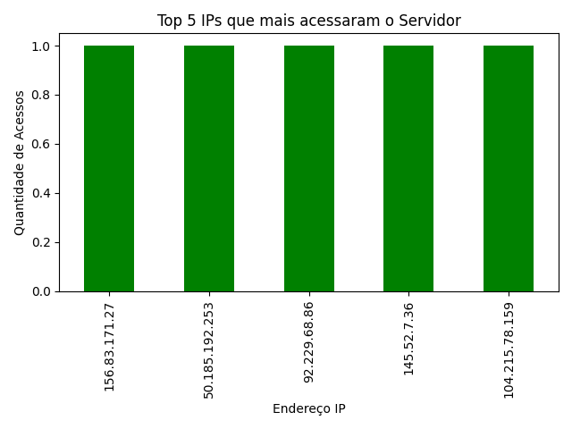
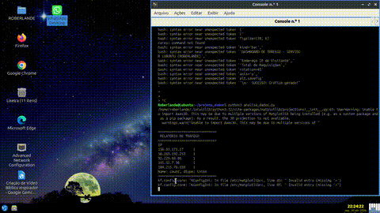

# 📊 Análise de Tráfego de Rede com Python
### 👉 [CLIQUE AQUI PARA VER O VÍDEO DEMONSTRATIVO](https://github.com/Roberlanderrsilva/analise-trafego-python/raw/main/demo_final.mp4)

Este projeto automatiza a análise de logs de tráfego, identificando os principais endereços IP e gerando visualizações automáticas para auditoria.

## 🚀 Como funciona
O projeto foi desenvolvido para ser executado via linha de comando, processando os dados e gerando um dashboard instantâneo.

### 📈 Dashboard Gerado

### 🎥 Demonstração da Execução
Você pode conferir o script em funcionamento no vídeo abaixo:
### 👉 [CLIQUE AQUI PARA VER O VÍDEO DEMONSTRATIVO](https://github.com/Roberlanderrsilva/analise-trafego-python/raw/main/demo_final.mp4)

## 🛠️ Tecnologias
* **Python 3**
* **Pandas**: Para manipulação de dados.
* **Matplotlib/Seaborn**: Para geração de gráficos.

## 🎥 Demonstração da Execução

---

---
⭐ *Projeto desenvolvido por [Roberlande Silva](https://github.com/Roberlanderrsilva)*
